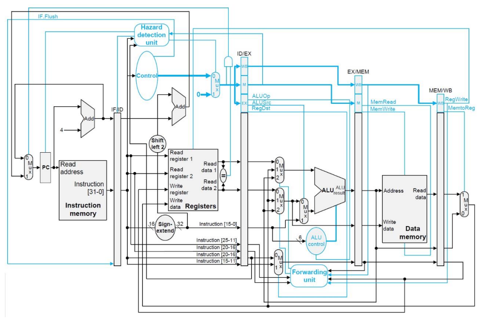
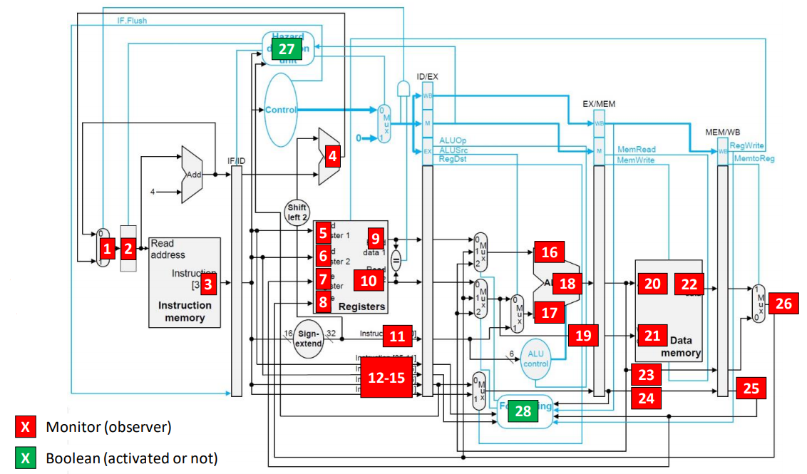

# MIPS32 Simulator
Cycle-Accurate simulation of a pipelined MIPS32 Processor in C.

Features:
- Hazard Detection
- Forwarding

## Supported Instructions

**Instruction** | **Functionality**
----------- | -------------
add | Add
addi | Add Immediate
addiu | Add Immediate Unsigned
addu | Add Unsigned
and | And
andi | And Immediate
beq | Branch On Equal
bne | Branch On Not Equal
lw | Load Word
nor | Nor
or | Or
ori | Or Immediate
slt | Set Less Than
slti | Set Less Than Immediate
sltiu | Set Less Than Immediate Unsigned
sltu | Set Less Than Unsigned
sll | Shift Left Logical
srl | Shift Right Logical
sw | Store Word
sub | Subtract
subu | Subtract Unsigned

## Input

- Text file including the assembly instructions
- Selected cycles for which extra data will be exported

## Outputs

- Final Register Values
- Monitor/Obserbers Values for selected cycles (see diagram below)
- Instruction in each pipeline stage for selected cycles (*IF*,*ID*,*EX*,*MEM*,*WB*)

